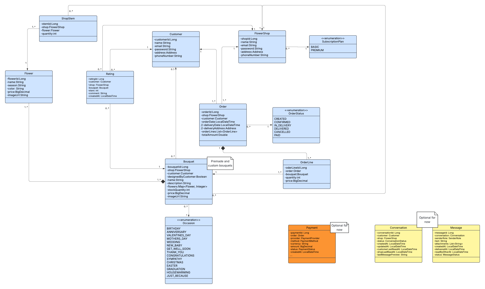

# 🌸 BLÜMEO – Project Documentation

## 1. Project Title & Tagline
- **Project Name:** BLÜMEO  
 A digital platform connecting private customers with local flower shops.

## 2. Project Overview / Introduction
**BLÜMEO** is an innovative web-based platform designed to bridge the gap between **local flower shops** and **customers** through an intuitive and interactive website.  
It allows private customers to **create their own custom bouquets using a 3D editor** and conveniently order them from nearby florists.  

For local flower shops, BLÜMEO provides a simple gateway into **digitalization**—helping them manage their assortment online, reach new customers, and compete effectively in the modern market without needing their own website.  

By combining **technology, creativity, and community**, BLÜMEO supports both customers and florists, making the flower-buying experience more personal, accessible, and local.

---
## 3. Objectives / Goals
- To create a **hyperlocal marketplace** that connects nearby flower shops with customers.  
- To enable **3D bouquet customization** so customers can design their own flower arrangements virtually.  
- To simplify **inventory and order management** for florists.  
- To improve **digital visibility** and customer retention for local flower shops.  

## 4. Benefits of the Project
### For Customers:
- Design personalized bouquets in 3D using the website and order from local florists.  
- Place orders independently of their location with just a few clicks.  
- Explore unique floral combinations visually before purchasing. (?) 
- Enjoy a fast, convenient, and interactive online experience.  

### For Local Florists:
- Gain digital presence **without needing their own website**.  
- Manage inventory, pricing, and product listings online with an easy-to-use interface.  
- Reach new customers and expand their market without technical knowledge or effort.  
- Access insights and analytics to track performance and improve services.  
- Benefit from new advertising and marketing opportunities on the platform.  
- Simplify product and order management, saving time and effort.

## 5. Target Groups
- **Private Customers:** Individuals who want to buy or design personalized bouquets for any occasion.  
- **Local Flower Shops:** Small and medium-sized florists looking to digitize their business.   
- **Administrators:** Manage users, shops, orders, and system integrity.

## 6. Team Members

| Name | Role | Responsibilities |
|------|------|------------------|
| **Anastasiia Kulyani** | *[Role]* | *[Responsibilities]* |
| **Akanksha Vijayvergiya** | *[Role]* | *[Responsibilities]* |
| **Averest Osman** | *[Role]* | *[Responsibilities]* |
| **Sama Al Zou'bi** | *[Role]* | *[Responsibilities]* |

## 7. Functionalities / Features
### 🌸 Private Customers
- **Registration & Login (mock):** Create and access user accounts easily.  
- **Home Page:** Displays featured flower hubs, top-rated florists, and highlights.  
- **Search & Filter:** Search by flower type, price, occasion, or location.  
- **3D Bouquet Design:** Customize bouquets by selecting individual flowers, colors, and wrapping options. (?)
- **Flower Shop Pages:** View local florist profiles with their offers, ratings, and contact info.  
- **Shopping Cart:** Add, remove, or modify items; includes delivery and payment options (mock).  
- **Chat Function:** Communicate directly with flower shops or interact with a chatbot for support.  
- **Notifications:** Get alerts for new offers, order updates, and subscription reminders. (?)
- **User Profile:** Manage personal details, saved addresses, subscriptions, and order history.
  
### 🌼 Flower Shops
- **Business Registration & Login:** Register and set up shop profile.  
- **Inventory Management:** Digitally manage and update floral products with prices and stock.  
- **Public Shop View:** Display available offers and collections to nearby customers.  
- **Customer Reviews:** View customer ratings and feedback.  
- **Order Overview:** Track new, pending, and completed orders with action controls (accept, prepare, deliver).  
- **Chat Function (Optional):** Communicate directly with customers for custom orders or support.  
- **Performance Statistics:** Access insights on sales, customer activity, and top-selling flowers.  
- **Bouquet Customization Management (Optional):** Manage bouquet customization options and control flower availability for customers.

## 8. System Architecture

## 9. Tech Stack
_(List technologies, frameworks, and tools used)_

## 10. User Flow / Module Description
_(Explain how users interact with the app step-by-step)_

## 11. Future Enhancements
_(List possible improvements or planned features for future versions)_

## 12. Conclusion
_(Summarize what makes the project unique and impactful)_

## 13. References
_(Include APIs, design inspirations, or external resources used)_

